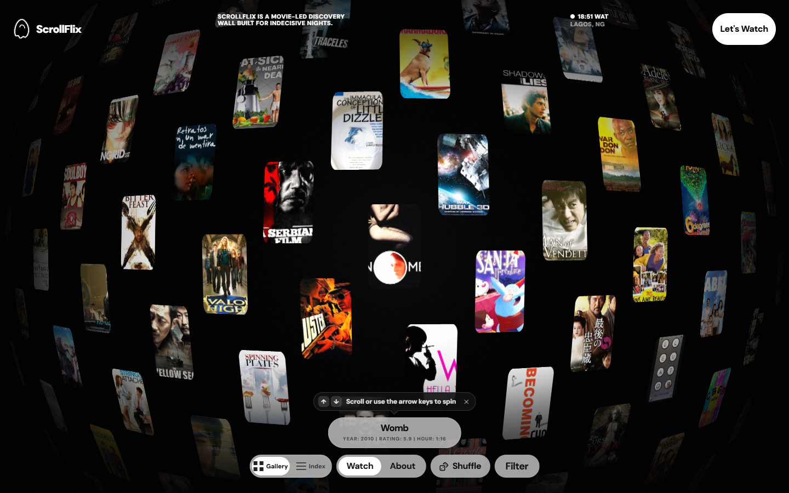

# ScrollFlix — for when you can't pick a movie

Stop scrolling lists. Spin a wall of 750 films and stop on whatever catches your eye.



A custom WebGL wall you scroll, drag and spin. Open any poster for details, save favorites, and jump out to your own streaming or review links.

**[Spin the wall →](https://scroll-flix.vercel.app)** · React · TypeScript · WebGL · Vite

---

## Why This Exists

Streaming services make it easy to access movies, but they do not always make it easy to choose one. Recommendation rows can feel repetitive, search assumes you already know what you want, and watchlists can become another pile of decisions.

ScrollFlix is my personal answer to that problem. It is a playful, visual way to browse films when the only thing you know is that you want to watch something. The goal is not to optimize the choice down to a perfect recommendation. The goal is to make browsing feel interesting enough that a choice naturally appears.

## What It Does

ScrollFlix presents movies as a wall of posters on an interactive WebGL globe. You drag, scroll or use the arrow keys to spin it, and open any poster for details, in a more exploratory way than a normal catalog.

You can use it to:

- Browse films visually when you are undecided.
- Open a movie preview and inspect basic details.
- Shuffle to a random film, or browse the same films as an index with several sorts.
- Narrow the wall by genre, year, rating, runtime and mood.
- Switch between light and dark interface themes.

## Product Focus

This project is designed around a simple user journey:

1. You arrive because you want to watch something.
2. The app gives you a visual field of possibilities instead of another rigid list.
3. You move through posters, colors, clusters, and previews.
4. A title catches your attention.
5. You open it, save it, or follow a link to keep exploring elsewhere.

The product idea is intentionally lightweight: reduce the blank-screen feeling of choosing a movie, and make the browsing process itself enjoyable.

## Core Features

### Visual Movie Discovery

The main experience is an interactive movie canvas powered by WebGL. It is built to make a large collection of films feel browseable, tactile, and alive.

### Film Preview

Selecting a film opens a focused view with movie details and related actions. The app is meant to help you quickly decide whether a title is worth following up on.

### Index And Filters

The same films are available as an index with six sorts (A-Z, year, rating, runtime, popularity and vote count) and a filters page. Ratings are weighted by vote count so a handful of votes cannot outrank a well-known film.

### Theme

The light and dark themes are switched from the About drawer, and the choice is remembered locally.

## Who It Is For

ScrollFlix is for people who:

- Want to watch a movie but do not have a title in mind.
- Prefer browsing and discovery over strict recommendation feeds.
- Like visual interfaces and exploratory tools.
- Keep running into the same suggestions on streaming platforms.
- Want a personal, low-pressure way to stumble into their next movie.

## Current Status

This is an active personal project. The core app experience is present, with a React interface and a custom WebGL globe.

The public landing page is not live yet.


## Tech Stack

- React 19
- TypeScript
- Vite
- Tailwind CSS
- Radix UI primitives
- A hand-written WebGL2 engine with inline GLSL shaders for the globe
- Vitest for unit tests
- Playwright for end-to-end tests
- Biome for linting and formatting

## How It Works

The app has two main parts, both under `app/cmps/views/test-gallery/`:

- `test-gallery.tsx` is the page shell. It handles the gallery, index and filters views, movie details, shuffle, and keyboard shortcuts.
- `infinite-movie-menu.tsx` is the WebGL engine. It lays posters out on a sphere, uploads them into a texture atlas as they load, handles drag, wheel and keyboard rotation with inertia, and picks the poster under a click.

Film data and poster media are served from the `public/` directory.

## Project Structure

```text
app/
  cmps/
    ui/                 Shared UI primitives
    views/test-gallery/ The page shell and the WebGL globe engine
  utils/                Animation helpers and opt-in telemetry
  main.tsx              Browser entry point

public/
  json/                 Film metadata
  media/                Poster thumbnails and the placeholder sprite
  assets/               Static visual assets

playwright-tests/       End-to-end tests
scripts/                Utility scripts
docs/                   Supporting project notes
```

## Local Development

### Requirements

- Node.js and npm are used by the toolchain.
- A modern browser with WebGL support is required to run the app properly.

### Install

```bash
npm install
```

### Start The Dev Server

```bash
npm run dev
```

The app runs at:

```text
http://localhost:3000
```

### Build

```bash
npm run build
```

### Preview A Production Build

```bash
npm run preview
```

## Scripts

```bash
npm run dev                 Start the Vite development server
npm run build               Type-check and build for production
npm run preview             Preview the production build
npm run lint                Run Biome linting
npm run format              Format files with Biome
npm run check               Run Biome checks
npm run check:write         Apply Biome fixes
npm run test                Run Vitest
npm run test:unit           Run unit tests
npm run test:unit:coverage  Run unit tests with coverage
npm run test:e2e            Run Playwright tests
npm run test:e2e:headed     Run Playwright tests in a visible browser
npm run media:posters       Build the local poster thumbnail library
```

## Configuration

For local development, copy the example environment file:

```bash
cp .env.local.example .env.local
```

Useful environment values include:

```bash
VITE_TEXTURES_BASE_URL=/media
VITE_FILM_INFO_BASE_URL=/json
VITE_TELEMETRY_ENABLED=false
VITE_TELEMETRY_ENDPOINT=
VITE_APP_VERSION=
```

## Data And Attribution

Poster thumbnails are prepared ahead of deployment and served from
`public/media/posters/`. Run `npm run media:posters` after changing the movie
catalog. The generator is resumable, preserves usable local poster assets, and
writes a detailed `manifest.json` report plus a small `availability.json` index;
the gallery uses the index to avoid requesting missing images and displays its
generated fallback instead. On a managed
Windows network with TLS inspection, run Node with its system CA support.
If stored TMDB image paths have expired, set `TMDB_API_READ_TOKEN` before
running the command. The build-time generator will refresh those paths through
TMDB's movie-details API; the token is never exposed to the browser.
When legacy TMDB paths are unavailable, catalog preparation can use the movie's
IMDb ID to retrieve replacement artwork from MetaHub before normalizing and
hosting it locally.

This project includes movie information derived from the Full TMDB Movies Dataset on Kaggle, made available under the ODC Attribution License.

Movie imagery is loaded and displayed for discovery and preview purposes. The app links out to external movie resources where applicable.

## Ownership

ScrollFlix is a personal project by ICE, also known as Kingsley Aremu.

The project is built as a personal exploration of movie discovery, visual browsing, and interactive recommendation-adjacent interfaces.

## License

See `LICENSE` for the repository license.

Additional licensing notes:

- Some shader work is covered by Creative Commons Attribution-NonCommercial-ShareAlike 3.0 Unported licensing. The Voroforce engine that this mainly concerned was removed in [#5](https://github.com/iice257/ScrollFlix/pull/5); the exception stays in `LICENSE` for earlier revisions and any related WebGL components that remain.
- Film data attribution follows the Open Data Commons Attribution License.

